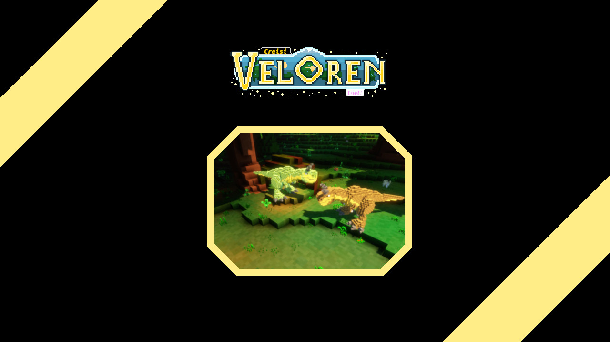

# 

## Welcome to Creisi Veloren!

Creisi Veloren is a multiplayer voxel RPG written in Rust. It is a fork of Veloren, an amazing free software game.

## Useful links

[Sign up](https://veloren.net/account/) - Here you can create an official account for Veloren.

[The Veloren website](https://veloren.net/) - The official Veloren website.

## FAQ

### **Q:** How is this game licensed?

**A:** **It is free to play, modify and distribute. Forever.** It is licensed under the **[GNU GPL 3.0](https://www.gnu.org/licenses/gpl-3.0.txt)** license which means it will always stay free and open source.

### **Q:** What platforms are supported?

**A:** Creisi Veloren can run on Windows and Linux, on x86_64 and ARM64 CPU architectures.
